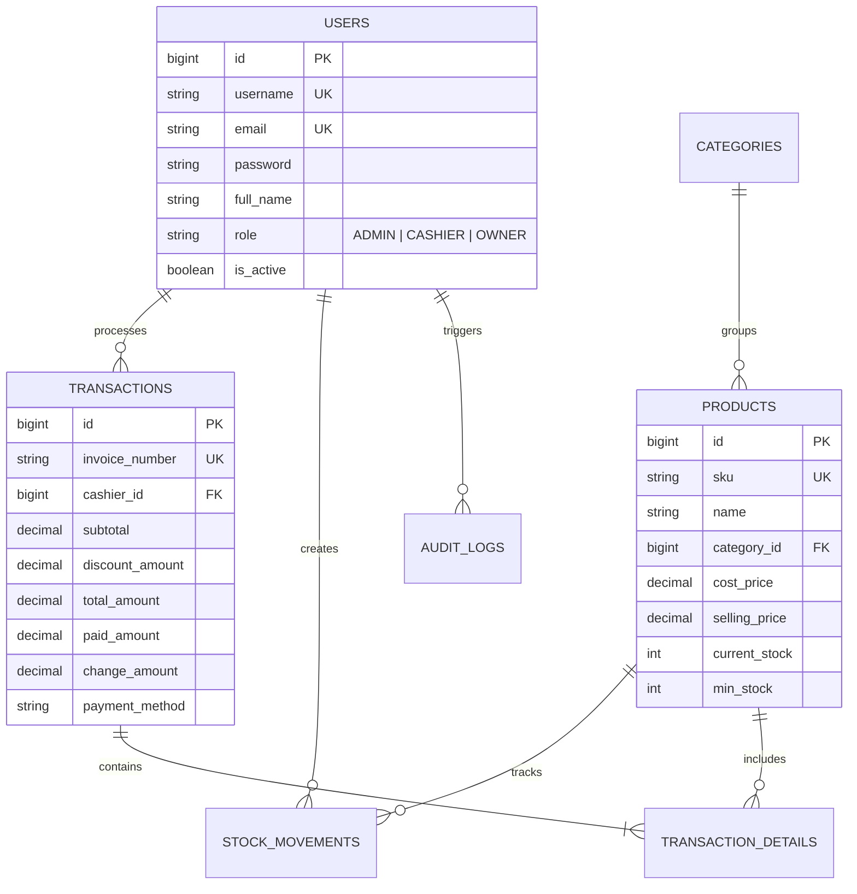

# StockFlow — Inventory & Sales Management System

[](https://www.oracle.com/java/)
[](https://spring.io/projects/spring-boot)
[](https://react.dev/)
[](https://www.typescriptlang.org/)
[](https://www.mysql.com/)
[](https://flywaydb.org/)
[](https://www.docker.com/)
[](LICENSE)

**StockFlow** adalah aplikasi manajemen inventori toko dan kasir (Point of Sale / POS) berbasis web modern yang dirancang khusus untuk bisnis UMKM / retail toko kelontong. Project ini dibuat dengan standar arsitektur backend berkelas industri (**Java Spring Boot 3 + Spring Security JWT + MySQL + Flyway**) dan frontend modern (**React 18 + TypeScript + Tailwind CSS**) sebagai portofolio profesional untuk posisi **Full-stack / Backend Developer**.

---

## 🚀 Fitur Utama Sistem

1. **🔐 Authentication & Role Guard**:
   - Spring Security JWT Stateless Authentication dengan enkripsi BCrypt.
   - Hak akses dinamis berbasis Role: `ADMIN`, `CASHIER`, dan `OWNER`.
   - Quick Demo Role Switcher pada UI untuk review portofolio yang instan.

2. **🛒 Point of Sale (POS) & Cashier Engine**:
   - **Zero-Trust Pricing**: Backend menghitung ulang harga & total transaksi dari database produk.
   - **Concurrency Safety (`FOR UPDATE`)**: Menggunakan *Pessimistic Write Locking* pada database MySQL untuk mencegah kebocoran stok atau stok negatif pada transaksi kasir bersamaan.
   - **Atomic Transaction (`@Transactional`)**: Seluruh alur checkout (pemotongan stok, pembuatan invoice, detail item, dan log stok `SALE`) dibungkus dalam 1 transaksi DB. Terjadi rollback otomatis jika ada kesalahan.
   - Cetak Struk Penjualan fisik visual (Print preview modal).

3. **📦 Product & Category Management**:
   - Pengelolaan produk dengan SKU Unik, Kategori, Harga Modal, Harga Jual, Stok Minimum, dan Satuan Unit.
   - Kalkulasi otomatis *Gross Margin Profit* per item produk.
   - Peringatan Notifikasi Stok Menipis (`currentStock <= minStock`).
   - Pencarian cepat SKU / Barcode scanner kompatibel.

4. **🔄 Inventory Movement & Supplier Restock**:
   - Catat stok masuk dari distributor/supplier resmi.
   - Penyesuaian stok manual (Stock Adjustment) akibat barang rusak, kedaluwarsa, atau opname gudang.
   - Audit trail seluruh pergerakan stok (`IN`, `OUT`, `ADJUSTMENT`, `SALE`).

5. **📊 Executive Analytics & Sales Reports**:
   - Metric Cards: Omset Penjualan, Estimasi Keuntungan Kotor (Gross Profit), Nilai Persediaan Stok, & Total Transaksi.
   - Visual Bar Chart Tren Penjualan & Top 5 Produk Terlaris.
   - **Ekspor Laporan CSV**: Unduh data transaksi penjualan dalam format spreadsheet `.csv`.

6. **📜 Audit Log Engine**:
   - Mencatat jejak aktivitas penting pengguna (nama staf, peran, aksi, entitas yang diubah, dan timestamp).

---

## 📐 Arsitektur Sistem & ERD Database



---

## 🔑 Akun Demo Kredensial Login

| Username | Password | Role | Hak Akses Utama |
| :--- | :--- | :--- | :--- |
| `admin` | `password123` | `ADMIN` | Penuh: Master Produk, Supplier, Restock, Adjustment, User Mgmt, Audit Log |
| `kasir1` | `password123` | `CASHIER` | Operasional: POS Kasir Checkout, Katalog Produk, Cetak Struk |
| `owner` | `password123` | `OWNER` | Eksekutif: Dashboard Stats, Margin Profit, Laporan Penjualan, Ekspor CSV |

---

## ⚡ Panduan Instalasi & Cara Menjalankan

### Metode A: Menggunakan Docker Compose (Direkomendasikan)

Pastikan Docker & Docker Compose sudah terpasang, lalu jalankan:

```bash
docker-compose up --build
```

Aplikasi akan otomatis berjalan:
- **Frontend App**: `http://localhost:3000`
- **Backend API**: `http://localhost:8080`
- **Interactive Swagger UI**: `http://localhost:8080/swagger-ui.html`

---

### Metode B: Menjalankan Secara Manual (Local Development)

#### 1. Persyaratan Sistem
- Java 17 LTS atau lebih baru
- Node.js 18+ & npm
- Database MySQL 8.0

#### 2. Jalankan Backend (Spring Boot)
```bash
cd stockflow-backend
# Buat database stockflow_db di MySQL lokal Anda
mvn spring-boot:run
```

#### 3. Jalankan Frontend (React + TypeScript)
```bash
cd stockflow-frontend
npm install
npm run dev
```

---

## 🧪 Hasil Pengujian Otomatis (Unit Test Suite)

Sistem telah diuji menggunakan **JUnit 5 + Mockito**:
- `AuthServiceTest`: Autentikasi JWT & Password Validation.
- `ProductServiceTest`: Validasi SKU Unik & Margin Profit.
- `TransactionConcurrencyTest`: Menguji 2 thread transaksi yang mencoba membeli stok item terakhir secara bersamaan.
- `ReportServiceTest`: Filter laporan berdasarkan rentang tanggal.

Jalankan pengujian:
```bash
cd stockflow-backend
mvn test
```
*Hasil Output*: **`Tests run: 7, Failures: 0, Errors: 0, Skipped: 0 - BUILD SUCCESS`**.

---

## 🛡️ Keputusan Desain & Keamanan Terbuka

1. **Pessimistic Locking `FOR UPDATE`**:
   Untuk mencegah stok negatif di MySQL pada kondisi lalu lintas transaksi kasir yang padat, method `findByIdWithPessimisticLock` mengunci baris produk hingga transaksi DB selesai.
2. **Zero-Trust Pricing Architecture**:
   Harga barang tidak diambil dari frontend melainkan dihitung langsung di backend dari tabel `products`, mencegah potensi manipulasi harga pada sisi klien.
3. **Stateless JWT Security**:
   Token JWT ditandatangani dengan algoritma HMAC-SHA256 tanpa sesi server, sehingga ringan dan siap untuk *horizontal scaling*.

---

## 📄 Lisensi

Project ini dirilis di bawah lisensi [MIT License](LICENSE).
